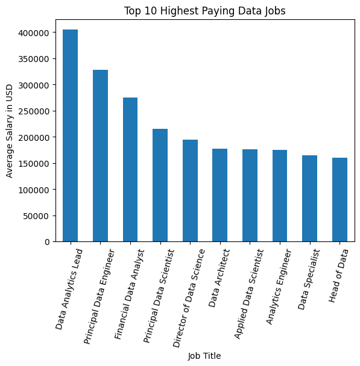
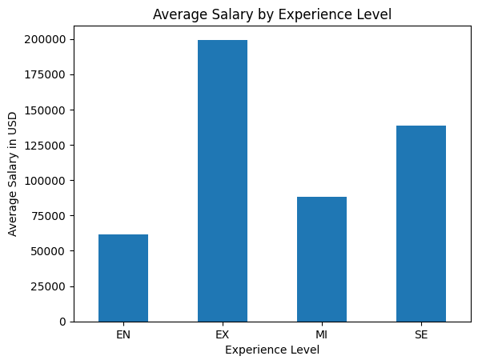
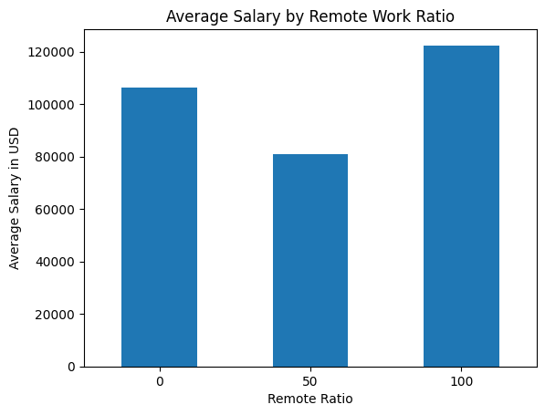
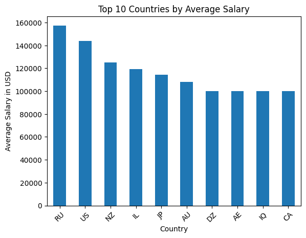
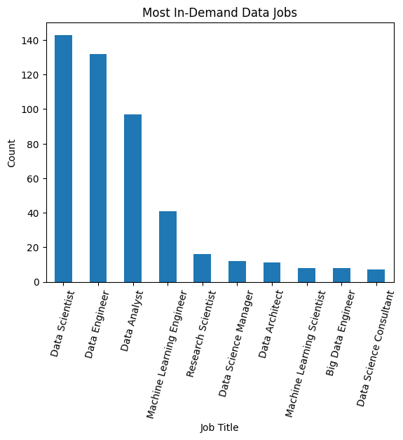

# Gulf Tech Jobs Analysis 📊

## 📌 Project Overview
This project analyzes global data science job salaries and trends using Python.

The analysis explores:
- Highest paying data jobs
- Experience level impact on salary
- Remote work salary trends
- Most in-demand data roles
- Top-paying countries

---

## 🛠️ Technologies Used
- Python
- Pandas
- Matplotlib
- Jupyter Notebook

---

## 📂 Project Structure

gulf-tech-jobs-analysis/
│
├── data/
├── images/
├── notebooks/
├── analysis.ipynb
└── README.md

---

## 📈 Key Insights

- Executive-level professionals earn the highest salaries.
- Remote jobs tend to offer higher average salaries.
- Data Scientist and Data Engineer are the most demanded roles.
- Senior and executive positions dominate top salary ranges.

---

# 📊 Visualizations

## Top 10 Highest Paying Data Jobs

---

## Average Salary by Experience Level

---

## Average Salary by Remote Work Ratio

---

## Top 10 Countries by Average Salary

---

## Most In-Demand Data Jobs

---

## 📁 Dataset
Dataset source:
Data Science Salaries Dataset from Kaggle.

---

## 🚀 Author
Data Science Graduate passionate about AI, Analytics, and Machine Learning.